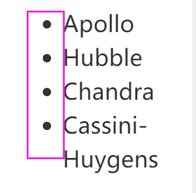

# Movie Seat Booking

Display movie choices and seats in a theater to select from in order to purchase tickets

## Project Specifications

- Display UI with movie select, screen, seats, legend & seat info
- User can select a movie/price
- User can select/deselect seats
- User can not select occupied seats
- Number of seats and price will update
- Save seats, movie and price to local storage so that UI is still populated on refresh

Design inspiration from [Dribbble](https://dribbble.com/shots/3628370-Movie-Seat-Booking)

# sth need to know
## html
### select标签
创建带有 4 个选项的选择列表：
```html
<select>
  <option value ="volvo">Volvo</option>
  <option value ="saab">Saab</option>
  <option value="opel">Opel</option>
  <option value="audi">Audi</option>
</select>
```

### ul
HTML `<ul>` 标签
实例
无序 HTML 列表：

```html
<ul>
  <li>Coffee</li>
  <li>Tea</li>
  <li>Milk</li>
</ul>
```

### span
HTML` <span> `标签
使用` <span> `元素对文本中的一部分进行着色：

```html
<p>我的母亲有 <span style="color:blue">蓝色</span> 的眼睛。</p>
```

## css
### flex-direction
前提是上边有display:flex
CSS flex-direction 属性指定了内部元素是如何在 flex 容器中布局的，定义了主轴的方向

`column`
flex容器的主轴和块轴相同。主轴起点与主轴终点和书写模式的前后点相同


### align-items
>
align-items属性将所有直接子节点上的align-self值设置为一个组。 align-self属性设置项目在其包含块中在交叉轴方向上的对齐方式。

Flexbox和CSS网格布局支持此属性。在Flexbox中，它控制十字轴上项目的对齐方式，在网格布局中，它控制块轴上项目的对齐方式。

center:

如图所示，因为是center，所以上方和下方留有空余

### justify-content
>
justify-content 属性定义了浏览器之间，如何分配顺着弹性容器主轴(或者网格行轴) 的元素之间及其周围的空间

`center`
伸缩元素向每行中点排列。每行第一个元素到行首的距离将与每行最后一个元素到行尾的距离相同。

`space-between`
均匀排列每个元素
首个元素放置于起点，末尾元素放置于终点

### margin
外边距
```
/* 应用于所有边 */
margin: 1em;
margin: -3px;

/* 上边下边 | 左边右边 */
margin: 5% auto;

/* 上边 | 左边右边 | 下边 */
margin: 1em auto 2em;

/* 上边 | 右边 | 下边 | 左边 */
margin: 2px 1em 0 auto;
```
### padding
内边距

### -moz-appearance -webkit-appearance
css3特性

为了去除系统默认appearance的样式引发的问题?

在基于 Gecko 的浏览器（如 Firefox）中，-moz-appearance CSS 属性被用于按照 浏览器所在的操作系统所用主题，以平台本地的样式显示元素。

在基于 WebKit 的浏览器（如 Safari）和基于 Blink 的浏览器（如 Chrome, Opera）中，-webkit-appearance 属性被用于达到相同 to achieve the same thing. Note that Edge also supports -webkit-appearance (instead of -ms-appearance) for compatibility reasons.

>
The appearance property is used to display an element using a platform-native styling based on the users’ operating system’s theme.

### perspective
CSS 属性 perspective指定了观察者与 z=0 平面的距离，使具有三维位置变换的元素产生透视效果。 z>0 的三维元素比正常大，而 z<0 时则比正常小，大小程度由该属性的值决定

none


800px


### border-top-left/right-radius

### border
默认的border可能有一定的宽度，所以有的时候要设置成0

### class中有空格
比如class="s s"
css中定义为.s.s{}

### nth-of-type(2)
:nth-of-type() 这个 CSS 伪类是针对具有一组兄弟节点的标签, 用 n 来筛选出在一组兄弟节点的位置。

+ example
```css
/* 在每组兄弟元素中选择第四个 <p> 元素 */
p:nth-of-type(4n) {
  color: lime;
}
```

```css
.seat:nth-of-type(2){
	margin-right:18px;
}
```
对于每一个div下的div class="seat"的第二个div做右外边距调整

### :nth-last-of-type
:nth-last-of-type(an+b) 这个 CSS 伪类 匹配那些在它之后有 an+b-1 个相同类型兄弟节点的元素，其中 n 为正值或零值。它基本上和 :nth-of-type 一样，只是它从结尾处反序计数，而不是从开头处。

### hover
>
:hover CSS伪类适用于用户使用指示设备虚指一个元素（没有激活它）的情况。这个样式会被任何与链接相关的伪类重写，像:link, :visited, 和 :active等。为了确保生效，:hover规则需要放在:link和:visited规则之后，但是在:active规则之前，按照LVHA的循顺序声明:link－:visited－:hover－:active。
:hover伪类可以任何伪元素上使用。
用户的可视客户端比如Firefox, Internet Explorer, Safari, Opera or Chrome

添加后可应用transform

### transform
>transform属性允许你旋转，缩放，倾斜或平移给定元素。这是通过修改CSS视觉格式化模型的坐标空间来实现的

transform: scale(1.2);
放大1.2倍

transform: rotateX(-45deg);
rotationX（）CSS函数定义了一个变换，该变换绕着横坐标（水平轴）旋转元素而不会变形

### not
.seat:not(.occupied):hover

已知html里有`seat` `seat occpuied`两个class

### rgba
RGBA 即红色、绿色、蓝色、透明度（英语：Red, Green, Blue、Alpha）

### list-style-type


### box-shadow
```
/* x偏移量 | y偏移量 | 阴影颜色 */
box-shadow: 60px -16px teal;

/* x偏移量 | y偏移量 | 阴影模糊半径 | 阴影颜色 */
box-shadow: 10px 5px 5px black;

/* x偏移量 | y偏移量 | 阴影模糊半径 | 阴影扩散半径 | 阴影颜色 */
box-shadow: 2px 2px 2px 1px rgba(0, 0, 0, 0.2);

/* 插页(阴影向内) | x偏移量 | y偏移量 | 阴影颜色 */
box-shadow: inset 5em 1em gold;

/* 任意数量的阴影，以逗号分隔 */
box-shadow: 3px 3px red, -1em 0 0.4em olive;
```

### flex
http://www.ruanyifeng.com/blog/2015/07/flex-grammar.html


>容器默认存在两根轴：水平的主轴（main axis）和垂直的交叉轴（cross axis）。主轴的开始位置（与边框的交叉点）叫做main start，结束位置叫做main end；交叉轴的开始位置叫做cross start，结束位置叫做cross end。

项目默认沿主轴排列。单个项目占据的主轴空间叫做main size，占据的交叉轴空间叫做cross size。

以下6个属性设置在容器上。
```
flex-direction
flex-wrap
flex-flow
justify-content
align-items
align-content
```

justify-content属性定义了项目在主轴上的对齐方式。
```css
.box {
  justify-content: flex-start | flex-end | center | space-between | space-around;
}
```


flex-start（默认值）：左对齐
flex-end：右对齐
center： 居中
space-between：两端对齐，项目之间的间隔都相等。
space-around：每个项目两侧的间隔相等。所以，项目之间的间隔比项目与边框的间隔大一倍。

## js
### .querySelectorAll()
返回与指定的选择器组匹配的文档中的元素列表 (使用深度优先的先序遍历文档的节点)。返回的对象是 NodeList 。
querySelector
返回指定元素节点的子树中匹配selector的集合中的第一个

### 变量前加'+'
把后面的内容转成 number 类型

### localstorage
只读的localStorage 属性允许你访问一个Document 源（origin）的对象 Storage；存储的数据将保存在浏览器会话中。localStorage 类似 sessionStorage，但其区别在于：存储在 localStorage 的数据可以长期保留；而当页面会话结束——也就是说，当页面被关闭时，存储在 sessionStorage 的数据会被清除 。

应注意，无论数据存储在 localStorage 还是 sessionStorage ，它们都特定于页面的协议。

另外，localStorage 中的键值对总是以字符串的形式存储。 (需要注意, 和js对象相比, 键值对总是以字符串的形式存储意味着数值类型会自动转化为字符串类型).

### es6（...）这三个点在JavaScript中意味着什么？
https://segmentfault.com/a/1190000016168214
array/object  
也叫做rest运算符,...nums,那么nums还拥有之前所定义的属性,但是在后面我们也可以传递新值来覆盖原本属性，我觉得类似于继承
如果用于数组，只能在末尾添加
```js
const num1=[1,2,3];
const num2=[...num1,1,2,3];//this will be [1,2,3,1,2,3]
```
### map
map() 方法创建一个新数组，其结果是该数组中的每个元素是调用一次提供的函数后的返回值。

### 箭头函数
```js
var elements = [
  'Hydrogen',
  'Helium',
  'Lithium',
  'Beryllium'
];

elements.map(function(element) { 
  return element.length; 
}); // 返回数组：[8, 6, 7, 9]

// 上面的普通函数可以改写成如下的箭头函数
elements.map((element) => {
  return element.length;
}); // [8, 6, 7, 9]


x => x * x;
function (x) {
    return x * x;
}
```

### indexOf()
indexOf()方法返回在数组中可以找到一个给定元素的第一个索引，如果不存在，则返回-1。

### JSON.stringify
JSON.stringify() 方法将一个 JavaScript 对象或值转换为 JSON 字符串，如果指定了一个 replacer 函数，则可以选择性地替换值，或者指定的 replacer 是数组，则可选择性地仅包含数组指定的属性。
 存储前先用JSON.stringify()方法将json对象转换成json字符串形式；
 localStorage 的存储格式都是字符串，任何其他类型都要转成字符串存储。

### JSON.parse
JSON.parse() 方法用来解析JSON字符串，构造由字符串描述的JavaScript值或对象。提供可选的 reviver 函数用以在返回之前对所得到的对象执行变换(操作)。

### forEach
>
forEach() 方法对数组的每个元素执行一次给定的函数。

```js
const array1 = ['a', 'b', 'c'];

array1.forEach(element => console.log(element));

// expected output: "a"
// expected output: "b"
// expected output: "c"
```

### classList
Element.classList 是一个只读属性，返回一个元素的类属性的实时 DOMTokenList 集合。

相比将 element.className 作为以空格分隔的字符串来使用，classList 是一种更方便的访问元素的类列表的方法。

### .addEventListener
EventTarget.addEventListener() 方法将指定的监听器注册到 EventTarget 上，当该对象触发指定的事件时，指定的回调函数就会被执行。 事件目标可以是一个文档上的元素 Element,Document和Window或者任何其他支持事件的对象 (比如 XMLHttpRequest)。

addEventListener()的工作原理是将实现EventListener的函数或对象添加到调用它的EventTarget上的指定事件类型的事件侦听器列表中。

### Event.target
触发事件的对象 (某个DOM元素) 的引用。当事件处理程序在事件的冒泡或捕获阶段被调用时，

### toggle(visible)
如果 visible 类值已存在，则移除它，否则添加它