---

[TOC]

---

# css
## align-items
>CSS align-items属性将所有直接子节点上的align-self值设置为一个组。 align-self属性设置项目在其包含块中在交叉轴方向上的对齐方式。
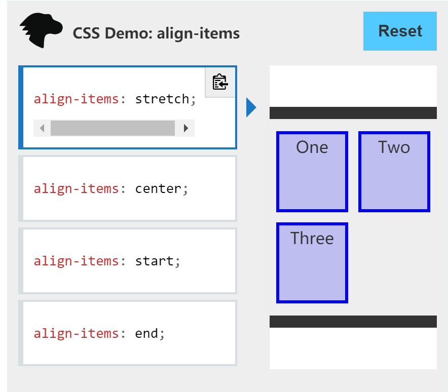


## backface-visibility
CSS 属性backface-visibility 指定当元素背面朝向观察者时是否可见。
```css
/* Keyword values */
backface-visibility: visible;
backface-visibility: hidden;
```

## background
background-image:url('')
一般会跟上
  background-repeat
  background-size
  background-position
样式设置
>
在no-repeat情况下，如果容器宽高比与图片宽高比不同，
cover：图片宽高比不变、铺满整个容器的宽高，而图片多出的部分则会被截掉；
contain:图片自身的宽高比不变，缩放至图片自身能完全显示出来，所以容器会有留白区域；
在repeat情况下：
cover:与上述相同；
contain:容器内至少有一张完整的图，容器留白区域则平铺背景图，铺不下的再裁掉。

## background-position
```css
/* Keyword values */
background-position: top;
background-position: bottom;
background-position: left;
background-position: right;
background-position: center;

/* <percentage> values */
background-position: 25% 75%;

/* <length> values */
background-position: 0 0;
background-position: 1cm 2cm;
background-position: 10ch 8em;

/* Multiple images */
background-position: 0 0, center;

/* Edge offsets values */
background-position: bottom 10px right 20px;
background-position: right 3em bottom 10px;
background-position: bottom 10px right;
background-position: top right 10px;

/* Global values */
background-position: inherit;
background-position: initial;
background-position: unset;
```

## background-repeat
 background-repeat CSS 属性定义背景图像的重复方式。背景图像可以沿着水平轴，垂直轴，两个轴重复，或者根本不重复。

```
 /* 单值语法 */
background-repeat: repeat-x;
background-repeat: repeat-y;
background-repeat: repeat;
background-repeat: space;
background-repeat: round;
background-repeat: no-repeat;

/* 双值语法: 水平horizontal | 垂直vertical */
background-repeat: repeat space;
background-repeat: repeat repeat;
background-repeat: round space;
background-repeat: no-repeat round;

background-repeat: inherit;
```


## background-size
```css
/* 关键字 */
background-size: cover
background-size: contain

/* 一个值: 这个值指定图片的宽度，图片的高度隐式的为auto */
background-size: 50%
background-size: 3em
background-size: 12px
background-size: auto

/* 两个值 */
/* 第一个值指定图片的宽度，第二个值指定图片的高度 */
background-size: 50% auto
background-size: 3em 25%
background-size: auto 6px
background-size: auto auto

/* 逗号分隔的多个值：设置多重背景 */
background-size: auto, auto     /* 不同于background-size: auto auto */
background-size: 50%, 25%, 25%
background-size: 6px, auto, contain

/* 全局属性 */
background-size: inherit;
background-size: initial;
background-size: unset;
```

## flex-wrap
CSS flex-wrap 指定 flex 元素单行显示还是多行显示 。如果允许换行，这个属性允许你控制行的堆叠方向。  

+ nowrap
flex 的元素被摆放到到一行，这可能导致溢出 flex 容器。 cross-start  会根据 flex-direction 的值 相当于 start 或 before。
+ wrap
flex 元素 被打断到多个行中。cross-start 会根据 flex-direction 的值选择等于start 或before。cross-end 为确定的 cross-start 的另一端。
+ wrap-reverse
和 wrap 的行为一样，但是 cross-start 和 cross-end 互换。

## justify-content
>CSS justify-content 属性定义了浏览器之间，如何分配顺着弹性容器主轴(或者网格行轴) 的元素之间及其周围的空间。与flex布局方式相关
```css
/* Positional alignment */
justify-content: center;     /* 居中排列 */
justify-content: start;      /* Pack items from the start */
justify-content: end;        /* Pack items from the end */
justify-content: flex-start; /* 从行首起始位置开始排列 */
justify-content: flex-end;   /* 从行尾位置开始排列 */
justify-content: left;       /* Pack items from the left */
justify-content: right;      /* Pack items from the right */

/* Baseline alignment */
justify-content: baseline;
justify-content: first baseline;
justify-content: last baseline;

/* Distributed alignment */
justify-content: space-between;  /* 均匀排列每个元素
                                   首个元素放置于起点，末尾元素放置于终点 */
justify-content: space-around;  /* 均匀排列每个元素
                                   每个元素周围分配相同的空间 */
justify-content: space-evenly;  /* 均匀排列每个元素
                                   每个元素之间的间隔相等 */
justify-content: stretch;       /* 均匀排列每个元素
                                   'auto'-sized 的元素会被拉伸以适应容器的大小 */

/* Overflow alignment */
justify-content: safe center;
justify-content: unsafe center;

/* Global values */
justify-content: inherit;
justify-content: initial;
justify-content: unset;
```
center：

## position
+ relative
当一个元素的position属性设置为relative，它将使用相对定位。 相对定位的元素在普通流中进行定位，它将出现在文档流中原本的位置。 然而，可以通过设置水平或垂直偏移量，使它相对于原本的位置，偏移指定的距离，移动到新的位置。position:relative 对 table-\*-group, table-row, table-column, table-cell, table-caption 元素无效。
相对定位元素经常被用来作为绝对定位元素的容器块。

>
（1）relative 生成相对定位的元素，相对于其正常位置进行定位。
（2）相对定位完成的过程如下：
首先按默认方式（static）生成一个元素(并且元素像层一样浮动了起来)。
然后相对于以前的位置移动，移动的方向和幅度由 left、right、top、bottom 属性确定，偏移前的位置保留不动。

```css
.box {
  display: inline-block;
  width: 100px;
  height: 100px;
  background: red;
  color: white;
}

#two {
  position: relative;
  top: 20px;
  left: 20px;
  background: blue;
}
```


+ static
该关键字指定元素使用正常的布局行为，即元素在文档常规流中当前的布局位置。此时 top, right, bottom, left 和 z-index 属性无效。

+ relative
该关键字下，元素先放置在未添加定位时的位置，再在不改变页面布局的前提下调整元素位置（因此会在此元素未添加定位时所在位置留下空白）。position:relative 对 table-\*-group, table-row, table-column, table-cell, table-caption 元素无效。

+ absolute
元素会被移出正常文档流，并不为元素预留空间，通过指定元素相对于最近的非 static 定位祖先元素的偏移，来确定元素位置。绝对定位的元素可以设置外边距（margins），且不会与其他边距合并。
绝对定位，盒子的位置以它的包含框为基准进行偏移。绝对定位的盒子从标准流中脱离。这意味着它们对其后的兄弟盒子的定位没有影响，其它的盒子就好像这个盒子不存在一样  
+ fixed
元素会被移出正常文档流，并不为元素预留空间，而是通过指定元素相对于屏幕视口（viewport）的位置来指定元素位置。元素的位置在屏幕滚动时不会改变。打印时，元素会出现在的每页的固定位置。fixed 属性会创建新的层叠上下文。当元素祖先的 transform, perspective 或 filter 属性非 none 时，容器由视口改为该祖先。
position:fixed 的元素将相对于屏幕视口（viewport）的位置来指定其位置。并且元素的位置在屏幕滚动时不会改变


+ sticky
元素根据正常文档流进行定位，然后相对它的最近滚动祖先（nearest scrolling ancestor）和 containing block (最近块级祖先 nearest block-level ancestor)，包括table-related元素，基于top, right, bottom, 和 left的值进行偏移。偏移值不会影响任何其他元素的位置。
该值总是创建一个新的层叠上下文（stacking context）。注意，一个sticky元素会“固定”在离它最近的一个拥有“滚动机制”的祖先上（当该祖先的overflow 是 hidden, scroll, auto, 或 overlay时），即便这个祖先不是最近的真实可滚动祖先。这有效地抑制了任何“sticky”行为

+ 相对父元素进行定位
父元素设置为 absolute
子元素设置为 relative

## transform
>transform属性允许你旋转，缩放，倾斜或平移给定元素。这是通过修改CSS视觉格式化模型的坐标空间来实现的

transform: scale(1.2);
放大1.2倍

transform: rotateX(-45deg);
rotationX（）CSS函数定义了一个变换，该变换绕着横坐标（水平轴）旋转元素而不会变形
rotateY() 函数定义了一个转换，它可以让一个元素围绕纵坐标(垂直轴)旋转，而不会对其进行变形
当rotate()中的值为正值时，顺时针旋转
rotateX(deg)  定义沿着X轴的3D旋转
rotateY(deg)  定义沿着Y轴的3D旋转
rotateZ(deg)  定义沿着Z轴的3D旋转  
rotateZ()如果为正，则顺时针方向移动；如果为负，则逆时针方向移动。   

translateY() 在页面垂直移动元素
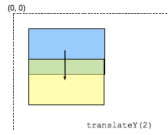

百分比指的是盒子高度，盒子由属性 transform-box 定义。
transform: translateY(-50%) 实现元素垂直居中效果
```css
position: absolute;
top: 50%;
transform: translateY(-50%);
```

+ skewY() 函数定义了一个转换，该转换将元素倾斜到二维平面上的垂直方向
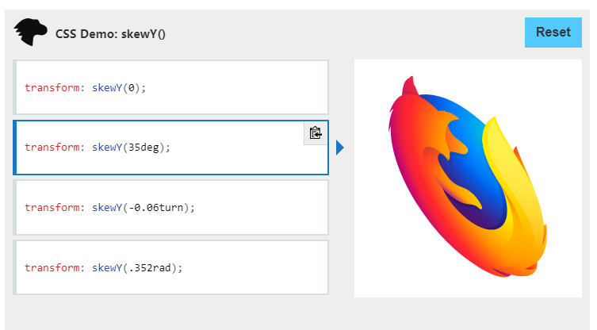
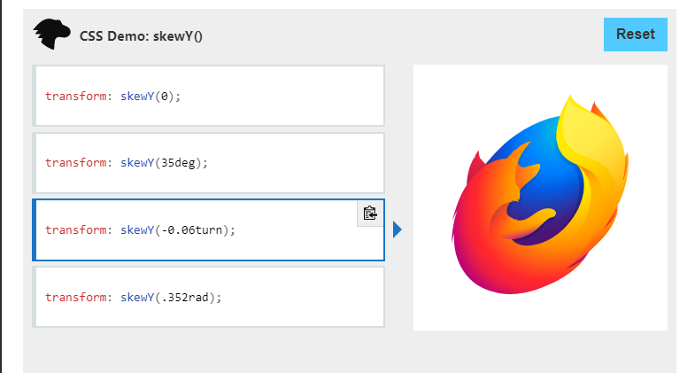


## vh(view height)
```css
body{
	min-height: 100vh;
}
```
>A percentage of the full viewport height. 10vh will resolve to 10% of the current viewport height.

+ 使用意义
使用 viewport height 的好處是讓我們能夠輕鬆達到響應式的設計，在不同裝置的瀏覽器內都能夠得到ㄧ致地效果

>
min-height 能够设置元素的最小高度。这样能够防止 height 属性的应用值小于 min-height 的值
当 min-height 大于 max-height 或 height 时，元素的高度会设置为 min-height 的值。

## \*{} box-sizing
>
\*{}代表的是所有HTML的doc元素标签
box-sizing 属性定义了 user agent 应该如何计算一个元素的总宽度和总高度

在 CSS 盒子模型的默认定义里，你对一个元素所设置的 width 与 height 只会应用到这个元素的内容区。如果这个元素有任何的 border 或 padding ，绘制到屏幕上时的盒子宽度和高度会加上设置的边框和内边距值。这意味着当你调整一个元素的宽度和高度时需要时刻注意到这个元素的边框和内边距。当我们实现响应式布局时，这个特点尤其烦人。

+ box-sizing:border-box
border-box 告诉浏览器：你想要设置的边框和内边距的值是包含在width内的。也就是说，如果你将一个元素的width设为100px，那么这100px会包含它的border和padding，内容区的实际宽度是width减去(border + padding)的值。大多数情况下，这使得我们更容易地设定一个元素的宽高

## :root{}
+ 定义
:root 这个 CSS 伪类匹配文档树的根元素。对于 HTML 来说，:root 表示 <html> 元素，除了优先级更高之外，与 html 选择器相同

+ 用途
在声明全局 CSS 变量时 :root 会很有用

+ example
```css
:root{
	--success-color:#2ecc71;
	--error-color:#e74c3c;
}


.form-control.success input {
  border-color: var(--success-color);
}

.form-control.error input {
  border-color: var(--error-color);
}
```


## cursor
cursor CSS 属性设置光标的类型（如果有），在鼠标指针悬停在元素上时显示相应样式。
pointer:悬浮于连接上时，通常为手
not-allowed 禁止图案

## display
[display:inline、display:block、display:inline-block三者真实用途及含义是什么？](https://blog.csdn.net/sinat_34719507/article/details/53512509)
display:block就是将元素显示为块级元素。
>
block元素的特点是：
总是在新行上开始；
高度，行高以及顶和底边距都可控制；
宽度缺省是它的容器的100%，除非设定一个宽度
`<div>`, `<p>`, `<h1>`, `<form>`, `<ul>` 和 `<li>`是块元素的例子。
此时进行 margin:auto可使元素居中

svg的display:none 线条会消失

display:inline-flex 
元素的行为类似于内联元素，并根据flexbox模型布置其内容。
等同于inline flex。

flex： 将对象作为弹性伸缩盒显示
inline-flex：将对象作为内联块级弹性伸缩盒显示
当Flex Box 容器没有设置宽度大小限制时，当display 指定为 flex 时，FlexBox 的宽度会填充父容器，当display指定为 inline-flex 时，FlexBox的宽度会包裹子Item

>display:inline-block将对象呈递为内联对象，但是对象的内容作为块对象呈递。旁边的内联对象会被呈递在同一行内，允许空格。
inline-block的元素特点：
将对象呈递为内联对象，但是对象的内容作为块对象呈递。旁边的内联对象会被呈递在同一行内，允许空格。
(准确地说，应用此特性的元素呈现为内联对象，周围元素保持在同一行，但可以设置宽度和高度地块元素的属性)
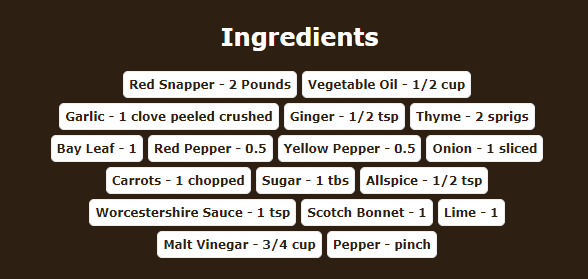


## visibility:hidden
元素框是不可见的（未绘制），但仍会正常影响布局。如果他们的元素的后代将是可见的visibility设置visible。元素无法获得焦点（例如，在选项卡索引中导航时）。

## box-shadow
```css
/* x偏移量 | y偏移量 | 阴影颜色 */
box-shadow: 60px -16px teal;

/* x偏移量 | y偏移量 | 阴影模糊半径 | 阴影颜色 */
box-shadow: 10px 5px 5px black;

/* x偏移量 | y偏移量 | 阴影模糊半径 | 阴影扩散半径 | 阴影颜色 */
box-shadow: 2px 2px 2px 1px rgba(0, 0, 0, 0.2);

/* 插页(阴影向内) | x偏移量 | y偏移量 | 阴影颜色 */
box-shadow: inset 5em 1em gold;

/* 任意数量的阴影，以逗号分隔 */
box-shadow: 3px 3px red, -1em 0 0.4em olive;

/* 全局关键字 */
box-shadow: inherit;
box-shadow: initial;
box-shadow: unset;

/* 左右边 上下边 */
box-shadow: 0 1px 3px rgba(0, 0, 0, 0.12), 0 1px 2px rgba(0, 0, 0, 0.24);
```

## margin
外边距
```css
/* 应用于所有边 */
margin: 1em;
margin: -3px;

/* 上边下边 | 左边右边 */
margin: 5% auto;

/* 上边 | 左边右边 | 下边 */
margin: 1em auto 2em;

/* 上边 | 右边 | 下边 | 左边 */
margin: 2px 1em 0 auto;

/* 全局值 */
margin: inherit;
margin: initial;
margin: unset;
```
length
以固定值为外边距。
percentage
相对于包含块的宽度，以百分比值为外边距。
auto
让浏览器自己选择一个合适的外边距。有时，在一些特殊情况下，该值可以使元素居中。水平居中

## padding
内边距
```css
/* 应用于所有边 */
padding: 1em;

/* 上边下边 | 左边右边 */
padding: 5% 10%;

/* 上边 | 左边右边 | 下边 */
padding: 1em 2em 2em;

/* 上边 | 右边 | 下边 | 左边 */
padding: 5px 1em 0 2em;

/* 全局值 */
padding: inherit;
padding: initial;
padding: unset;
```

## outline
>CSS 的 outline 属性是在一条声明中设置多个轮廓属性的简写属性 ， 例如 outline-style, outline-width 和 outline-color。 

outline不占据空间，绘制于元素内容周围。
根据规范，outline通常是矩形，但也可以是非矩形的。

## css定义有空格的类名
```
.a.b{
color:red
}
<div class="a b">try me</div>
```
## display: grid;
https://www.ruanyifeng.com/blog/2019/03/grid-layout-tutorial.html

>CSS 网格布局擅长于将一个页面划分为几个主要区域，以及定义这些区域的大小、位置、层次等关系（前提是HTML生成了这些区域）。
像表格一样，网格布局让我们能够按行或列来对齐元素。 然而在布局上，网格比表格更可能做到或更简单。 例如，网格容器的子元素可以自己定位，以便它们像CSS定位的元素一样，真正的有重叠和层次。

## grid-template

For example, grid-template: 50% 50% / 200px; will create a grid with two rows that are 50% each, and one column that is 200 pixels wide.

## grid-template-columns
该属性是基于网格列的维度，去定义网格线的名称和网格轨道的尺寸大小。
`<flex>`
非负值，用单位 fr 来定义网格轨道大小的弹性系数。 每个定义了 `<flex>` 的网格轨道会按比例分配剩余的可用空间。当外层用一个 minmax() 表示时，它将是一个自动最小值(即 minmax(auto, `<flex>`) ) .
```
grid-template-columns: repeat(4, 1fr);
```
grid-template-columns属性定义每一列的列宽

## repeat()
```css
.container {
  display: grid;
  grid-template-columns: repeat(3, 33.33%);
  grid-template-rows: repeat(3, 33.33%);
}
```

## fr 关键字
为了方便表示比例关系，网格布局提供了fr关键字（fraction 的缩写，意为"片段"）。如果两列的宽度分别为1fr和2fr，就表示后者是前者的两倍。

在下面的这个例子中，我们创建定义了一个2fr轨道和两个1fr轨道。可用空间被四等分。其中两份给了第一个轨道，剩下两个轨道各占一份。
```css
.wrapper {
  display: grid;
  grid-template-columns: 2fr 1fr 1fr;
}
```
在最后这个例子中，我们混合了绝对尺寸的轨道与分数单位轨道。第一个轨道是500像素，这个固定宽度被从可用空间中取走。剩下的空间被分为三份，按比例分配给了两个弹性尺寸轨道。
```css
.wrapper {
  display: grid;
  grid-template-columns: 500px 1fr 2fr;
}
```

## grid-column-start
grid-column-start属性定义该项目将从哪一列行开始。  

## grid-column-end
右边框所在的垂直网格线  
该grid-column-end属性定义一个项目将跨越多少列，或者该项目将在哪一列行结束，指定的这一列不算上  
这四个属性的值还可以使用span关键字，表示"跨越"，即左右边框（上下边框）之间跨越多少个网格。  

## grid-column | grid-row
```css
.item {
  grid-column: <start-line> / <end-line>;
  grid-row: <start-line> / <end-line>;
}
```

## grid-area
grid-area属性指定项目放在哪一个区域。
```css
.item {
  grid-area: <row-start> / <column-start> / <row-end> / <column-end>;
}
```

## grid-gap
gap 属性是用来设置网格行与列之间的间隙（gutters），该属性是row-gap and column-gap的简写形式。
该属性用来表示 <'row-gap'> 和 <'column-gap'>的值，而<'column-gap'>是可选的，假如 <'column-gap'> 缺失的话，则会被设置成跟<'row-gap'>一样的的值。

## letter-spacing
用于设置文本字符的间距表现

## line-height

## order
order 属性 设置或检索弹性盒模型对象的子元素出现的順序。。
默认情况下，所有grid item的顺序均为0，但可以将其设置为任何正值或负值，类似于z-index。

## flex-direction
前提是上边有display:flex
CSS flex-direction 属性指定了内部元素是如何在 flex 容器中布局的，定义了主轴的方向

`column`
flex容器的主轴和块轴相同。主轴起点与主轴终点和书写模式的前后点相同


## align-items
>
align-items属性将所有直接子节点上的align-self值设置为一个组。 align-self属性设置项目在其包含块中在交叉轴方向上的对齐方式。

Flexbox和CSS网格布局支持此属性。在Flexbox中，它控制十字轴上项目的对齐方式，在网格布局中，它控制块轴上项目的对齐方式。

center:

如图所示，因为是center，所以上方和下方留有空余

## justify-content
>
justify-content 属性定义了浏览器之间，如何分配顺着弹性容器主轴(或者网格行轴) 的元素之间及其周围的空间

`center`
伸缩元素向每行中点排列。每行第一个元素到行首的距离将与每行最后一个元素到行尾的距离相同。

`space-between`
均匀排列每个元素
首个元素放置于起点，末尾元素放置于终点

## margin
外边距
```
/* 应用于所有边 */
margin: 1em;
margin: -3px;

/* 上边下边 | 左边右边 */
margin: 5% auto;

/* 上边 | 左边右边 | 下边 */
margin: 1em auto 2em;

/* 上边 | 右边 | 下边 | 左边 */
margin: 2px 1em 0 auto;
```
## padding
内边距

## -moz-appearance -webkit-appearance
css3特性

为了去除系统默认appearance的样式引发的问题?

在基于 Gecko 的浏览器（如 Firefox）中，-moz-appearance CSS 属性被用于按照 浏览器所在的操作系统所用主题，以平台本地的样式显示元素。

在基于 WebKit 的浏览器（如 Safari）和基于 Blink 的浏览器（如 Chrome, Opera）中，-webkit-appearance 属性被用于达到相同 to achieve the same thing. Note that Edge also supports -webkit-appearance (instead of -ms-appearance) for compatibility reasons.

>
The appearance property is used to display an element using a platform-native styling based on the users’ operating system’s theme.

## perspective
CSS 属性 perspective指定了观察者与 z=0 平面的距离，使具有三维位置变换的元素产生透视效果。 z>0 的三维元素比正常大，而 z<0 时则比正常小，大小程度由该属性的值决定

none


800px


## border-top-left/right-radius

## border
默认的border可能有一定的宽度，所以有的时候要设置成0

## class中有空格
比如class="s s"
css中定义为.s.s{}

## nth-of-type(2)
:nth-of-type() 这个 CSS 伪类是针对具有一组兄弟节点的标签, 用 n 来筛选出在一组兄弟节点的位置。

+ example
```css
/* 在每组兄弟元素中选择第四个 <p> 元素 */
p:nth-of-type(4n) {
  color: lime;
}
```

```css
.seat:nth-of-type(2){
  margin-right:18px;
}
```
对于每一个div下的div class="seat"的第二个div做右外边距调整

## :nth-last-of-type
:nth-last-of-type(an+b) 这个 CSS 伪类 匹配那些在它之后有 an+b-1 个相同类型兄弟节点的元素，其中 n 为正值或零值。它基本上和 :nth-of-type 一样，只是它从结尾处反序计数，而不是从开头处。

## hover
>
:hover CSS伪类适用于用户使用指示设备虚指一个元素（没有激活它）的情况。这个样式会被任何与链接相关的伪类重写，像:link, :visited, 和 :active等。为了确保生效，:hover规则需要放在:link和:visited规则之后，但是在:active规则之前，按照LVHA的循顺序声明:link－:visited－:hover－:active。
:hover伪类可以任何伪元素上使用。
用户的可视客户端比如Firefox, Internet Explorer, Safari, Opera or Chrome

添加后可应用transform


## not
.seat:not(.occupied):hover

已知html里有`seat` `seat occpuied`两个class

## rgba
RGBA 即红色、绿色、蓝色、透明度（英语：Red, Green, Blue、Alpha）

## list-style-type


## box-shadow
```
/* x偏移量 | y偏移量 | 阴影颜色 */
box-shadow: 60px -16px teal;

/* x偏移量 | y偏移量 | 阴影模糊半径 | 阴影颜色 */
box-shadow: 10px 5px 5px black;

/* x偏移量 | y偏移量 | 阴影模糊半径 | 阴影扩散半径 | 阴影颜色 */
box-shadow: 2px 2px 2px 1px rgba(0, 0, 0, 0.2);

/* 插页(阴影向内) | x偏移量 | y偏移量 | 阴影颜色 */
box-shadow: inset 5em 1em gold;

/* 任意数量的阴影，以逗号分隔 */
box-shadow: 3px 3px red, -1em 0 0.4em olive;
```


## flex
http://www.ruanyifeng.com/blog/2015/07/flex-grammar.html


>容器默认存在两根轴：水平的主轴（main axis）和垂直的交叉轴（cross axis）。主轴的开始位置（与边框的交叉点）叫做main start，结束位置叫做main end；交叉轴的开始位置叫做cross start，结束位置叫做cross end。

项目默认沿主轴排列。单个项目占据的主轴空间叫做main size，占据的交叉轴空间叫做cross size。

以下6个属性设置在容器上。
```
flex-direction
flex-wrap
flex-flow
justify-content
align-items
align-content
```

justify-content属性定义了项目在主轴上的对齐方式。
```css
.box {
  justify-content: flex-start | flex-end | center | space-between | space-around;
}
```


flex-start（默认值）：左对齐
flex-end：右对齐
center： 居中
space-between：两端对齐，项目之间的间隔都相等。
space-around：每个项目两侧的间隔相等。所以，项目之间的间隔比项目与边框的间隔大一倍。

flex:1
[flex:0 flex:1 flex:none flex:auto应该在什么场景下使用？](https://www.zhangxinxu.com/wordpress/2020/10/css-flex-0-1-none/)
一个无单位数(`<number>`): 它会被当作flex:`<number>` 1 0; `<flex-shrink>`的值被假定为1，然后`<flex-basis>` 的值被假定为0。
 flex CSS简写属性设置了弹性项目如何增大或缩小以适应其弹性容器中可用的空间
flex属性是flex-grow，flex-shrink和flex-basis这3个CSS属性的缩写
flex-basis默认值是auto，flex-grow默认值是0，flex-shrink默认值是1。
>元素尺寸可以弹性增大，也可以弹性变小，具有十足的弹性，但是flex:1在尺寸不足时会优先最小化内容尺寸，flex:auto在尺寸不足时会优先最大化内容尺寸。
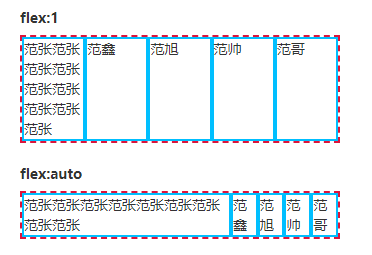

## flex-direction
column-reverse:
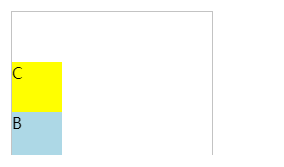
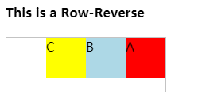

## important
当在一个样式声明中使用一个 !important 规则时，此声明将覆盖任何其他声明。虽然，从技术上讲，!important 与优先级无关，但它与最终的结果直接相关。使用 !important 是一个坏习惯，应该尽量避免，因为这破坏了样式表中的固有的级联规则 使得调试找bug变得更加困难了。当两条相互冲突的带有 !important 规则的声明被应用到相同的元素上时，拥有更大优先级的声明将会被采用。

+ 一定要优先考虑使用样式规则的优先级来解决问题而不是 !important
+ 只有在需要覆盖全站或外部 CSS 的特定页面中使用 !important
+ 永远不要在你的插件中使用 !important
+ 永远不要在全站范围的 CSS 代码中使用 !important

## background:transparent
背景透明

## @media
>@media CSS @规则 可用于基于一个或多个 媒体查询 的结果来应用样式表的一部分。 使用它，您可以指定一个媒体查询和一个CSS块，当且仅当该媒体查询与正在使用其内容的设备匹配时，该CSS块才能应用于该文档。


## input[type="range"] 浏览器兼容
https://css-tricks.com/styling-cross-browser-compatible-range-inputs-css/
需要在所有浏览器中将几种样式应用于范围输入，以覆盖其基本外观
```css
input[type=range] {
  -webkit-appearance: none; /* Hides the slider so that custom slider can be made */
  width: 100%; /* Specific width is required for Firefox. */
  background: transparent; /* Otherwise white in Chrome */
}

input[type=range]::-webkit-slider-thumb {
  -webkit-appearance: none;
}

input[type=range]:focus {
  outline: none; /* Removes the blue border. You should probably do some kind of focus styling for accessibility reasons though. */
}

input[type=range]::-ms-track {
  width: 100%;
  cursor: pointer;

  /* Hides the slider so custom styles can be added */
  background: transparent; 
  border-color: transparent;
  color: transparent;
}
```
这在所有浏览器中为我们提供了不可见或未设置样式的范围输入。现在，我们可以应用自定义样式。

## ::-webkit-slider-thumb
https://developer.mozilla.org/zh-CN/docs/Web/CSS/::-webkit-slider-thumb

这是type为range的input标签内的一种伪类样式,用于设置range的滑块的具体样式,该伪类只在内核为webkit/blink的浏览器中有效
该伪类需要配和::-webkit-slider-runnable-track使用,否则会没有效果
```css
input[type=range]::-webkit-slider-thumb{
    -webkit-appearance: none;/*清除默认样式*/
    height:7vw;/*设置滑块高度*/
    width:5vw;/*设置滑块宽度*/
    background:#000;/*设置背景色*/
    border-radius:10vw 10vw;/*加个圆角边*/
    margin-top:-1vw;/*使用position的话会导致滑块不滑动,但是绑定的value是改变的,所以这里使用margin-top去做定位*/
}
input[type=range]::-webkit-slider-runnable-track{
    border-radius: 30px; 
    background:#128;
    height:15px;
}
```

## ::-ms-track
非标准
此功能是非标准的，不在标准范围内。不要在面向Web的生产站点上使用它：它不适用于每个用户。实现之间也可能存在很大的不兼容性，并且将来的行为可能会更改。

在::-ms-trackCSS伪元素是微软扩展，代表一个滑块控件的轨道。滑块控件是`<input type =“ range”>`的一种可能表示形式。

## ::-ms-fill-lower
的CSS伪元素表示的滑块控制的轨道的下部; 即，对应于小于拇指当前选择的值的值的部分。滑块控件是<input type =“ range”>的一种可能表示形式。::-ms-fill-lower


## max-width & width
 若同时设置了width和max-width两个属性，则以下面规则显示宽度
+ 当width元素小于max-width时，元素宽度以width为准
+ 若超过max-width则以max-width为准。

## flex
https://developer.mozilla.org/zh-CN/docs/Web/CSS/flex
[flex:1 到底代表什么?](https://zhuanlan.zhihu.com/p/136223806)
>flex CSS简写属性设置了弹性项目如何增大或缩小以适应其弹性容器中可用的空间。

此属性是以下CSS属性的简写：

第一个参数表示: flex-grow 定义项目的放大比例，默认为0，即如果存在剩余空间，也不放大
第二个参数表示: flex-shrink 定义了项目的缩小比例，默认为1，即如果空间不足，该项目将缩小
第三个参数表示: flex-basis给上面两个属性分配多余空间之前, 计算项目是否有多余空间, 默认值为 auto, 即项目本身的大小

```css
/* 关键字值 */
flex: auto;
flex: initial;
flex: none;

/* 一个值, 无单位数字: flex-grow */
flex: 2;
flex: 1;/*平分元素*/

/* 一个值, width/height: flex-basis */
flex: 10em;
flex: 30px;
flex: min-content;

/* 两个值: flex-grow | flex-basis */
flex: 1 30px;

/* 两个值: flex-grow | flex-shrink */
flex: 2 2;

/* 三个值: flex-grow | flex-shrink | flex-basis */
flex: 2 2 10%;

/*全局属性值 */
flex: inherit;
flex: initial;
flex: unset;
```

## top
top样式属性定义了定位元素的上外边距边界与其包含块上边界之间的偏移，非定位元素设置此属性无效。


## transition
https://developer.mozilla.org/zh-CN/docs/Web/CSS/CSS_Transitions/Using_CSS_transitions

CSS transitions 提供了一种在更改CSS属性时控制动画速度的方法。 其可以让属性变化成为一个持续一段时间的过程，而不是立即生效的。比如，将一个元素的颜色从白色改为黑色，通常这个改变是立即生效的，使用 CSS transitions 后该元素的颜色将逐渐从白色变为黑色，按照一定的曲线速率变化。这个过程可以自定义。

通常将两个状态之间的过渡称为隐式过渡（implicit transitions），因为开始与结束之间的状态由浏览器决定。
```css
div {
    transition: <property> <duration> <timing-function> <delay>;
}
```
CSS 的一个常用地方是当鼠标悬停在菜单上时高亮此菜单，使用 transition 效果更佳。

其中的transform代表过渡，ease缓移

```css
/* Apply to 1 property */
/* property name | duration */
transition: margin-right 4s;

/* property name | duration | delay */
transition: margin-right 4s 1s;

/* property name | duration | timing function */
transition: margin-right 4s ease-in-out;

/* property name | duration | timing function | delay */
transition: margin-right 4s ease-in-out 1s;

/* Apply to 2 properties */
transition: margin-right 4s, color 1s;

/* Apply to all changed properties */
transition: all 0.5s ease-out;

/* Global values */
transition: inherit;
transition: initial;
transition: unset;
```
transition需要触发一个事件才会随着时间改变其CSS属性；animation在不需要触发任何事件的情况下，也可以显式的随时间变化来改变元素CSS属性，达到一种动画的效果。  

## z-index
https://developer.mozilla.org/zh-CN/docs/Web/CSS/z-index

z-index 属性设定了一个定位元素及其后代元素或 flex 项目的 z-order。 当元素之间重叠的时候， z-index 较大的元素会覆盖较小的元素在上层进行显示。

对于一个已经定位的盒子（即其 position 属性值不是 static，这里要注意的是 CSS 把元素看作盒子），z-index 属性指定：

+ 盒子在当前堆叠上下文中的堆叠层级。
+ 盒子是否创建一个本地堆叠上下文。


## transform:translate
在translate 函数当中使用百分比是以该元素自身的宽高作为基准。

## :first-of-type
CSS 伪类 :first-of-type表示一组兄弟元素中其类型的第一个元素。

## text-decoration
text-decoration 这个CSS 属性是用于设置文本的修饰线外观的（下划线、上划线、贯穿线/删除线 或闪烁）

text-decoration-line
文本修饰的位置, 如下划线underline，删除线line-through
text-decoration-color
文本修饰的颜色
text-decoration-style
文本修饰的样式, 如波浪线wavy实线solid虚线dashed
text-decoration-thickness
文本修饰线的粗细

```css
.under {
  text-decoration: underline red;
}

.over {
  text-decoration: wavy overline lime;
}

.line {
  text-decoration: line-through;
}

.plain {
  text-decoration: none;
}

.underover {
  text-decoration: dashed underline overline;
}

.blink {
  text-decoration: blink;
}

.shorthand {
  text-decoration: underline solid red 5px;
}
```

## overflow
CSS属性 overflow 定义当一个元素的内容太大而无法适应 块级格式化上下文 时候该做什么。它是 overflow-x 和overflow-y的 简写属性 。
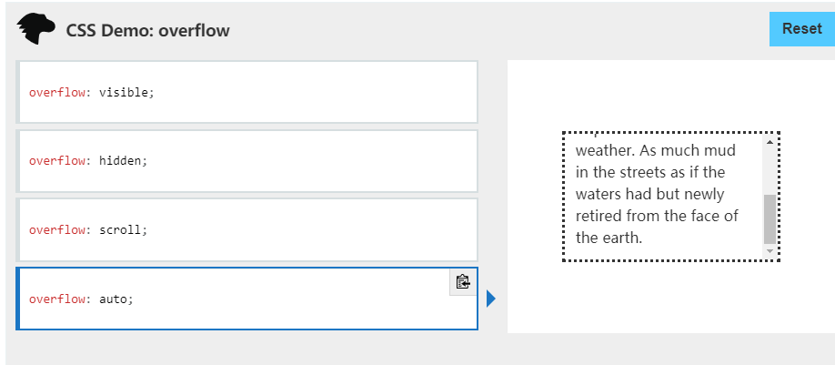

visible
默认值。内容不会被修剪，可以呈现在元素框之外。
hidden
如果需要，内容将被剪裁以适合填充框。 不提供滚动条。
scroll
如果需要，内容将被剪裁以适合填充框。 浏览器显示滚动条，无论是否实际剪切了任何内容。 （这可以防止滚动条在内容更改时出现或消失。）打印机仍可能打印溢出的内容。
auto
取决于用户代理。 如果内容适合填充框内部，则它看起来与可见内容相同，但仍会建立新的块格式化上下文。 如果内容溢出，桌面浏览器会提供滚动条。
overlay 
行为与auto相同，但滚动条绘制在内容之上而不是占用空间。 仅在基于WebKit（例如，Safari）和基于Blink的（例如，Chrome或Opera）浏览器中受支持。

## animation
该属性的子animation属性为：

animation-name
指定@keyframes描述动画关键帧的规则名称。

animation-duration
配置动画完成一个周期所需的时间。

animation-timing-function
配置动画的时间；也就是说，通过建立加速曲线，动画如何在关键帧之间过渡。

animation-delay
配置元素加载时间与动画序列开始之间的延迟。

animation-iteration-count
配置动画应重复的次数；您可以指定infinite无限期重复动画。

animation-direction
配置动画在序列中每次运行时是否应交替显示方向或重置为起点并重复自身。

animation-fill-mode
配置动画在执行之前和之后应用的值。
forwards
目标将保留由执行期间遇到的最后一个关键帧计算值。 最后一个关键帧取决于animation-direction和animation-iteration-count的值


animation-play-state
使您可以暂停和恢复动画序列。
```
animation-play-state: paused;
}
```

## @keyframes
与animation-nam相配合
```css

@keyframes modalopen {
  from {
    opacity: 0;
  }

  to {
    opacity: 1;
  }
}

@keyframes rotate {
  from {
    transform: rotate(0deg);
  }

  to {
    transform: rotate(360deg);
  }
}

@keyframes identifier {
  0% { top: 0; left: 0; }
  30% { top: 50px; }
  68%, 72% { left: 50px; }
  100% { top: 100px; left: 100%; }
}

```
关键帧 @keyframes at-rule 规则通过在动画序列中定义关键帧（或waypoints）的样式来控制CSS动画序列中的中间步骤。和 转换 transition 相比，关键帧 keyframes 可以控制动画序列的中间步骤。

## opacity
opacity属性指定了一个元素的不透明度。换言之，opacity属性指定了一个元素后面的背景的被覆盖程度。
```css
/* 完全不透明 */
opacity: 1;
opacity: 1.0;

/* 半透明 */
opacity: 0.6;

/* 完全透明 */
opacity: 0.0;
opacity: 0;

opacity: inherit;
```

## fill & stroke & stroke-linecap
fill属性设置对象内部的颜色，stroke属性设置绘制对象的线条的颜色


## :active
CSS `:active` 伪类匹配被用户激活的元素。它让页面能在浏览器监测到激活时给出反馈。当用鼠标交互时，它代表的是用户按下按键和松开按键之间的时间。

## border-radius
边框右上角和左下角的圆角半径。只在双值或三值语法中使用
```css
.round {
   border-radius: 5px 10px 15px 20px; /* top left, top right, bottom right, bottom left */
}
```

## text-transform
指定如何将元素的文本大写。它可以用于使文本显示为全大写或全小写，也可单独对每一个单词进行操作

## >
大于号代表选择子元素
```html
<body>
  <div id="我被选择" class="1">
    <div class="2">我没有被选择</div>
  </div>
</body>
```
body>div 只能选择class="1"的div，因为它是body的子代。而class="2"的div没有被选择。

## background-image:linear-gradient
CSS background-image 属性用于为一个元素设置一个或者多个背景图像

CSS linear-gradient() 函数用于创建一个表示两种或多种颜色线性渐变的图片。其结果属于`<gradient>`数据类型，是一种特别的`<image>`数据类型。
```css
/* 渐变轴为45度，从蓝色渐变到红色 */
linear-gradient(45deg, blue, red);

/* 从右下到左上、从蓝色渐变到红色 */
linear-gradient(to left top, blue, red);

/* 从下到上，从蓝色开始渐变、到高度40%位置是绿色渐变开始、最后以红色结束 */
linear-gradient(0deg, blue, green 40%, red);

  background-image: linear-gradient(
    to bottom,
    #eafbff 0%,
    #eafbff 50%,
    #5290f9 50%,
    #5290f9 100%
  );
```
## ::after
css的伪元素，之所以被称为伪元素，是因为他们不是真正的页面元素，html没有对应的元素，但是其所有用法和表现行为与真正的页面元素一样，可以对其使用诸如页面元素一样的css样式，表面上看上去貌似是页面的某些元素来展现，实际上是css样式展现的行为，因此被称为伪元素
[css伪元素:before和:after用法详解](https://www.cnblogs.com/wonyun/p/5807191.html)
CSS伪元素::after用来创建一个伪元素，作为已选中元素的最后一个子元素。通常会配合content属性来为该元素添加装饰内容。这个虚拟元素默认是行内元素。

这个两个伪元素在真正页面元素内部之前和之后添加新内容（当然了，可以对伪元素应用定位可以置于任何位置

设置:before和:after时必须设置其content属性，否则伪元素就不起作用

伪元素不属于文档，所以js无法操作它

伪元素属于主元素的一部分，因此点击伪元素触发的是主元素的click事件
```css
/* Add an arrow after links */
a::after {
  content: "→";
}
```
## object-fit
object-fit CSS 属性指定可替换元素的内容应该如何适应到其使用的高度和宽度确定的框。

+ contain
被替换的内容将被缩放，以在填充元素的内容框时保持其宽高比。 整个对象在填充盒子的同时保留其长宽比，因此如果宽高比与框的宽高比不匹配，该对象将被添加“黑边”。
+ cover
被替换的内容在保持其宽高比的同时填充元素的整个内容框。如果对象的宽高比与内容框不相匹配，该对象将被剪裁以适应内容框。
+ fill
被替换的内容正好填充元素的内容框。整个对象将完全填充此框。如果对象的宽高比与内容框不相匹配，那么该对象将被拉伸以适应内容框。
+ none
被替换的内容将保持其原有的尺寸。
+ scale-down
内容的尺寸与 none 或 contain 中的一个相同，取决于它们两个之间谁得到的对象尺寸会更小一些。

## calc()
calc() 此 CSS 函数允许在声明 CSS 属性值时执行一些计算
```
width: calc(100% - 40px);
```


## float
float CSS属性指定一个元素应沿其容器的左侧或右侧放置，允许文本和内联元素环绕它。该元素从网页的正常流动(文档流)中移除，尽管仍然保持部分的流动性（与绝对定位相反）。

## transform-style
CSS 属性 transform-style 设置元素的子元素是位于 3D 空间中还是平面中。
如果选择平面，元素的子元素将不会有 3D 的遮挡关系。
```css
/* Keyword values */
transform-style: flat;
transform-style: preserve-3d;

/* Global values */
transform-style: inherit;
transform-style: initial;
transform-style: unset;
```


## :active
CSS :active 伪类匹配被用户激活的元素。它让页面能在浏览器监测到激活时给出反馈。当用鼠标交互时，它代表的是用户按下按键和松开按键之间的时间。
```css

button:active {                                                                                            
  transform: scale(0.95);
}
```

## conic-gradient()
https://www.cnblogs.com/coco1s/p/7079529.html
圆锥渐变 起始点是图形中心，然后以顺时针方向绕中心实现渐变效果
```css
.gradient-circle {
  background: conic-gradient(
    #55b7a4 0%,
    #4ca493 40%,
    #fff 40%,
    #fff 60%,
    #336d62 60%,
    #2a5b52 100%
  );
}
```
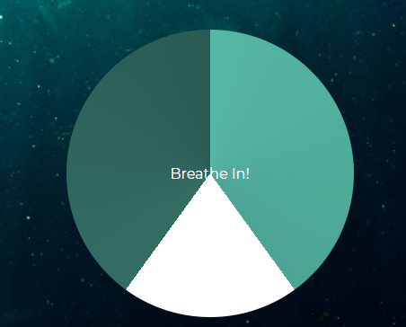

## header img设置
```css
  background-image: url('...');
  background-repeat: no-repeat;
  background-size: cover;
  background-position: center center;
```
+ background-size 设置背景图片大小。图片可以保有其原有的尺寸，或者拉伸到新的尺寸，或者在保持其原有比例的同时缩放到元素的可用空间的尺寸。
cover
缩放背景图片以完全覆盖背景区，可能背景图片部分看不见。和 contain 值相反，cover 值尽可能大的缩放背景图像并保持图像的宽高比例（图像不会被压扁）。该背景图以它的全部宽或者高覆盖所在容器。当容器和背景图大小不同时，背景图的 左/右 或者 上/下 部分会被裁剪。

+ background-position
background-position 为每一个背景图片设置初始位置。 这个位置是相对于由 background-origin 定义的位置图层的。
两个值的语法: 一个定义 x 坐标，另一个定义 y 坐标。

## filter
CSS属性将模糊或颜色偏移等图形效果应用于元素。滤镜通常用于调整图像，背景和边框的渲染。
+ blur()
blur() 函数将高斯模糊应用于输入图像。radius 定义了高斯函数的标准偏差值，或者屏幕上有多少像素相互融合，因此，较大的值将产生更多的模糊。若没有设置值，默认为0。该参数可以指定为 CSS 长度，但不接受百分比值。

## transform-origin
https://developer.mozilla.org/zh-CN/docs/Web/CSS/transform-origin

```css
transform-origin: x-axis y-axis z-axis;
```

```css
top left
```


## 增加一个dark overlay
```css
/* Add a dark overlay */
body::after {
  content: '';
  position: absolute;
  top: 0;
  left: 0;
  width: 100%;
  height: 100%;
  background-color: rgba(0, 0, 0, 0.5);
}
```
## 绝对定位下的居中
```css
  position: absolute;
  left: 50%;
  transform: translateX(-50%);
```
做好left和translateX的协调

## 隐藏元素 - display:none或visibility:hidden

隐藏一个元素可以通过把display属性设置为"none"，或把visibility属性设置为"hidden"。但是请注意，这两种方法会产生不同的结果。

visibility:hidden可以隐藏某个元素，但隐藏的元素仍需占用与未隐藏之前一样的空间。也就是说，该元素虽然被隐藏了，但仍然会影响布局。

display:none可以隐藏某个元素，且隐藏的元素不会占用任何空间。也就是说，该元素不但被隐藏了，而且该元素原本占用的空间也会从页面布局中消失。

## +
CSS兄弟相邻选择器加号“+”，可以选择指定元素相邻的下一个元素


# html
## http-equiv="X-UA-Compatible"
与content="IE=edge"相匹配

## small标签
>
<small> 标签呈现小号字体效果。
<small> 标签和它所对应的 <big> 标签一样，但它是缩小字体而不是放大。如果被包围的字体已经是字体模型所支持的最小字号，那么 <small> 标签将不起任何作用。
与 <big> 标签类似，<small> 标签也可以嵌套，从而连续地把文字缩小。每个 <small> 标签都把文本的字体变小一号，直到达到下限的一号字。

## select标签
创建带有 4 个选项的选择列表：
```html
<select>
  <option value ="volvo">Volvo</option>
  <option value ="saab">Saab</option>
  <option value="opel">Opel</option>
  <option value="audi">Audi</option>
</select>
```

## ul
HTML `<ul>` 标签
实例
无序 HTML 列表：

```html
<ul>
  <li>Coffee</li>
  <li>Tea</li>
  <li>Milk</li>
</ul>
```

## span
HTML` <span> `标签
使用` <span> `元素对文本中的一部分进行着色：

```html
<p>我的母亲有 <span style="color:blue">蓝色</span> 的眼睛。</p>
```

## link-integrity&crossorigin

两个属性一般在获取外部资源时使用

```html
<link href="https://maxcdn.bootstrapcdn.com/bootstrap/3.3.5/css/bootstrap.min.css" 
rel="stylesheet" 
integrity="sha256-MfvZlkHCEqatNoGiOXveE8FIwMzZg4W85qfrfIFBfYc= sha512-dTfge/zgoMYpP7QbHy4gWMEGsbsdZeCXz7irItjcC3sPUFtf0kuFbDz/ixG7ArTxmDjLXDmezHubeNikyKGVyQ==" 
crossorigin="anonymous">
```

integrity:
子资源完整性 (SRI) 是一项安全功能，可让浏览器验证其抓取的文件 (例如，从一个 CDN) 是在没有意外操作的情况下传递的。它的工作原理是允许您提供一个获取的文件必须匹配的加密散列/哈希。
允许浏览器检查文件源，以确保如果源已被操纵，则从不加载代码。

crossorigin:
该枚举属性指定在加载相关图片时是否必须使用CORS。可取的值包括以下两个：
- anonymous：会发起一个跨域请求（即包含Origin: HTTP头）。但不会发送任何认证信息（即不发送cookie, X.509证书和HTTP基本认证信息）。如果服务器没有给出源站凭证（不设置Access-Control-Allow-Origin: HTTP头），这张图片就会被污染并限制使用。
- use-credentials：会发起一个带有认证信息 (发送 cookie, X.509 证书和 HTTP 基本认证信息) 的跨域请求 (即包含 Origin: HTTP 头). 如果服务器没有给出源站凭证 (不设置 Access-Control-Allow-Origin: HTTP 头), 这张图片就会被污染并限制使用.
- 当不设置该属性时, 资源将会不使用 CORS 加载 (即不发送 Origin: HTTP 头), 这将阻止其在 元素中进行使用. 若设置了非法的值, 则视为使用 anonymous.


## i 标签
`<i>` 标签显示斜体文本效果。
例子:作为按钮中的图标显示

## input-type:range
`<input type =“ range”>`定义了一个控件，用于输入其确切值不重要的数字（如滑块控件）。 默认范围是0到100。但是，您可以使用min，max和step属性设置对可接受的数字的限制

```html
<form>
  <label for="vol">Volume (between 0 and 50):</label>
  <input type="range" id="vol" name="vol" min="0" max="50">
</form>
```


## video

```html
    <video
      src="videos/gone.mp4"
      id="video"
      class="screen"
      poster="img/poster.png"
    ></video>
```


## aside
>HTML <aside> 元素表示一个和其余页面内容几乎无关的部分，被认为是独立于该内容的一部分并且可以被单独的拆分出来而不会使整体受影响。其通常表现为侧边栏或者标注框（call-out boxes）。

```html
<aside>
    <p>The Rough-skinned Newt defends itself with a deadly neurotoxin.</p>
</aside>
```


## img-alt
alt:alt 属性是一个必需的属性，它规定在图像无法显示时的替代文本  

## input-value
预定义

## main
>HTML <main> 元素呈现了文档的 <body> 或应用的主体部分。主体部分由与文档直接相关，或者扩展于文档的中心主题、应用的主要功能部分的内容组成。

在文档中，`<main> `元素的内容应当是独一无二的。任何同时存在于任意一系列文档中的相同、重复内容，比如侧边栏、导航栏链接、版权信息、网站 Logo，搜索框（除非搜索框为文档的主要功能），都不应当被包含在其内。

`<main>` 对文档的大纲（outline）没有贡献；也就是说，它与诸如 `<body>` 之类的元素，诸如 `<h2>` 之类的标题等不同，`<main>` 不会影响 DOM 的页面结构概念。它仅有提供信息的作用。（原文：It's strictly informative.）

## nav
HTML `<nav>` 元素表示页面的一部分，其目的是在当前文档或其他文档中提供导航链接。导航部分的常见示例是菜单，目录和索引。

## svg
可缩放矢量图形（Scalable Vector Graphics，SVG），是一种用于描述二维的矢量图形，基于 XML 的标记语言。作为一个基于文本的开放网络标准，SVG能够优雅而简洁地渲染不同大小的图形，并和CSS，DOM，JavaScript和SMIL等其他网络标准无缝衔接。

## svg line & circle
line元素是一个SVG基本形状，用来创建一条连接两个点的线。

## section
表示一个包含在HTML文档中的独立部分，它没有更具体的语义元素来表示，一般来说会有包含一个标题。

## audio
```html
<audio src="music/ukulele.mp3" id="audio"></audio>
```

## input
autocomplete
autocomplete 属性规定输入字段是否应该启用自动完成功能。
自动完成允许浏览器预测对字段的输入。当用户在字段开始键入时，浏览器基于之前键入过的值，应该显示出在字段中填写的选项。
注释：autocomplete 属性适用于 `<form>`，以及下面的 `<input>` 类型：text, search, url, telephone, email, password, datepickers, range 以及 color。
```html
<input autocomplete="value">
```

autofocus 属性规定当页面加载时 `<input>` 元素应该自动获得焦点。
```html
<input
        type="text"
        id="text"
        autocomplete="off"
        placeholder="Type the word here..."
        autofocus
      />
```
## location.reload()
```html
 <button onclick="location.reload()">Reload</button>
 ```
 Location.reload() 方法用来刷新当前页面。该方法只有一个参数，当值为 true 时，将强制浏览器从服务器加载页面资源，当值为 false 或者未传参时，浏览器则可能从缓存中读取页面。

该方法在跨域调用（执行该方法的脚本文件的域和 Location 对象所在页面的跨不同）时，将会抛出 DOMException 异常

## canvas
Canvas API 提供了一个通过JavaScript 和 HTML的`<canvas>`元素来绘制图形的方式。它可以用于动画、游戏画面、数据可视化、图片编辑以及实时视频处理等方面。

Canvas API主要聚焦于2D图形。而同样使用`<canvas>`元素的 WebGL API 则用于绘制硬件加速的2D和3D图形。

HTML5 `<canvas>` 元素用于图形的绘制，通过脚本 (通常是JavaScript)来完成.
`<canvas>` 标签只是图形容器，必须使用脚本来绘制图形。
  一个画布在网页中是一个矩形框，通过 `<canvas>` 元素来绘制.
注意: 默认情况下 `<canvas>` 元素没有边框和内容。
`<canvas>`简单实例如下:
```html
<canvas id="myCanvas" width="200" height="100"></canvas>
```
注意: 标签通常需要指定一个id属性 (脚本中经常引用), width 和 height 属性定义的画布的大小.
```js
const ctx = canvas.getContext('2d');
```

# js
##.animate()
Element 接口的animate() 方法是一个创建新Animation的便捷方法，将它应用于元素，然后运行动画。它将返回一个新建的 Animation 对象实例
```js
document.getElementById("tunnel").animate([
  // keyframes
  { transform: 'translateY(0px)' },
  { transform: 'translateY(-300px)' }
], {
  // timing options
  duration: 1000,
  iterations: Infinity
});
```

## .charAt()
charAt() 方法从一个字符串中返回指定的字符。

## .querySelector()
querySelector() 方法返回文档中匹配指定 CSS 选择器的一个元素

## .slice()
slice() 方法返回一个新的数组对象，这一对象是一个由 begin 和 end 决定的原数组的浅拷贝（包括 begin，不包括end）。原始数组不会被改变。

+ example
```js
const animals = ['ant', 'bison', 'camel', 'duck', 'elephant'];

console.log(animals.slice(2));
// expected output: Array ["camel", "duck", "elephant"]

console.log(animals.slice(2, 4));
// expected output: Array ["camel", "duck"]

console.log(animals.slice(1, 5));
// expected output: Array ["bison", "camel", "duck", "elephant"]
```

## .test()
test() 方法执行一个检索，用来查看正则表达式与指定的字符串是否匹配。返回 true 或 false。

## .preventDefault()
Event 接口的 preventDefault()方法，告诉user agent：如果此事件没有被显式处理，它默认的动作也不应该照常执行。此事件还是继续传播，除非碰到事件侦听器调用stopPropagation() 或stopImmediatePropagation()，才停止传播。

## forEach()
```js
const array1 = ['a', 'b', 'c'];

array1.forEach(element => console.log(element));

// expected output: "a"
// expected output: "b"
// expected output: "c"
```
## .contains()
Node.contains()返回的是一个布尔值，来表示传入的节点是否为该节点的后代节点。

## .removeEventListener()

## .querySelectorAll()
返回与指定的选择器组匹配的文档中的元素列表 (使用深度优先的先序遍历文档的节点)。返回的对象是 NodeList 。
querySelector
返回指定元素节点的子树中匹配selector的集合中的第一个

## 变量前加'+'
把后面的内容转成 number 类型

## localstorage
只读的localStorage 属性允许你访问一个Document 源（origin）的对象 Storage；存储的数据将保存在浏览器会话中。localStorage 类似 sessionStorage，但其区别在于：存储在 localStorage 的数据可以长期保留；而当页面会话结束——也就是说，当页面被关闭时，存储在 sessionStorage 的数据会被清除 。

应注意，无论数据存储在 localStorage 还是 sessionStorage ，它们都特定于页面的协议。

另外，localStorage 中的键值对总是以字符串的形式存储。 (需要注意, 和js对象相比, 键值对总是以字符串的形式存储意味着数值类型会自动转化为字符串类型).

## es6（...）这三个点在JavaScript中意味着什么？
https://segmentfault.com/a/1190000016168214
array/object  
也叫做rest运算符,...nums,那么nums还拥有之前所定义的属性,但是在后面我们也可以传递新值来覆盖原本属性，我觉得类似于继承
如果用于数组，只能在末尾添加
```js
const num1=[1,2,3];
const num2=[...num1,1,2,3];//this will be [1,2,3,1,2,3]
```
## map
map() 方法创建一个新数组，其结果是该数组中的每个元素是调用一次提供的函数后的返回值。

## 箭头函数
```js
var elements = [
  'Hydrogen',
  'Helium',
  'Lithium',
  'Beryllium'
];

elements.map(function(element) { 
  return element.length; 
}); // 返回数组：[8, 6, 7, 9]

// 上面的普通函数可以改写成如下的箭头函数
elements.map((element) => {
  return element.length;
}); // [8, 6, 7, 9]


x => x * x;
function (x) {
    return x * x;
}
```

## indexOf()
indexOf()方法返回在数组中可以找到一个给定元素的第一个索引，如果不存在，则返回-1。

## JSON.stringify
JSON.stringify() 方法将一个 JavaScript 对象或值转换为 JSON 字符串，如果指定了一个 replacer 函数，则可以选择性地替换值，或者指定的 replacer 是数组，则可选择性地仅包含数组指定的属性。
 存储前先用JSON.stringify()方法将json对象转换成json字符串形式；
 localStorage 的存储格式都是字符串，任何其他类型都要转成字符串存储。

## JSON.parse
JSON.parse() 方法用来解析JSON字符串，构造由字符串描述的JavaScript值或对象。提供可选的 reviver 函数用以在返回之前对所得到的对象执行变换(操作)。

## forEach
>
forEach() 方法对数组的每个元素执行一次给定的函数。

```js
const array1 = ['a', 'b', 'c'];

array1.forEach(element => console.log(element));

// expected output: "a"
// expected output: "b"
// expected output: "c"
```

## .classList
Element.classList 是一个只读属性，返回一个元素的类属性的实时 DOMTokenList 集合。

+ add(class1, class2, ...)  在元素中添加一个或多个类名。
如果指定的类名已存在，则不会添加

+ remove(class1, class2, ...) 移除元素中一个或多个类名。
注意： 移除不存在的类名，不会报错。

相比将 element.className 作为以空格分隔的字符串来使用，classList 是一种更方便的访问元素的类列表的方法。

## .addEventListener
EventTarget.addEventListener() 方法将指定的监听器注册到 EventTarget 上，当该对象触发指定的事件时，指定的回调函数就会被执行。 事件目标可以是一个文档上的元素 Element,Document和Window或者任何其他支持事件的对象 (比如 XMLHttpRequest)。

addEventListener()的工作原理是将实现EventListener的函数或对象添加到调用它的EventTarget上的指定事件类型的事件侦听器列表中。

## Event.target
e.target
触发事件的对象 (某个DOM元素) 的引用。当事件处理程序在事件的冒泡或捕获阶段被调用时，

## .toggle(visible)
如果 visible 类值已存在，则移除它，否则添加它

## video相关操作
相关事件:https://developer.mozilla.org/zh-CN/docs/Web/Guide/Events/Media_events
video.paused
video.play()
video.pause()
video.currentTime 
video.duration 总长度

## Math.floor
向下取整

## fetch()
https://developer.mozilla.org/zh-CN/docs/Web/API/Fetch_API/Using_Fetch

>Fetch API 提供了一个 JavaScript 接口，用于访问和操纵 HTTP 管道的一些具体部分，例如请求和响应。它还提供了一个全局 fetch() 方法，该方法提供了一种简单，合理的方式来跨网络异步获取资源。

```js
fetch('http://example.com/movies.json')
  .then(function(response) {
    return response.json();
  })
  .then(function(myJson) {
    console.log(myJson);
  });
```
这里我们通过网络获取一个 JSON 文件并将其打印到控制台。最简单的用法是只提供一个参数用来指明想 fetch() 到的资源路径，然后返回一个包含响应结果的promise（一个 Response 对象）。

当然它只是一个 HTTP 响应，而不是真的JSON。为了获取JSON的内容，我们需要使用 json() 方法（在 Body mixin 中定义，被 Request 和 Response 对象实现）。
```js
  fetch(`https://api.exchangerate-api.com/v4/latest/${currency_one}`)
    .then(res => res.json())
    .then(data => {
      // console.log(data);
      const rate = data.rates[currency_two];

      rateEl.innerText = `1 ${currency_one} = ${rate} ${currency_two}`;

      amountEl_two.value = (amountEl_one.value * rate).toFixed(2);
    });
```
## .toFixed()
toFixed() 方法使用定点表示法来格式化一个数值。
小数点后数字的个数；介于 0 到 20 （包括）之间，实现环境可能支持更大范围。如果忽略该参数，则默认为 0。

## async
https://developer.mozilla.org/zh-CN/docs/learn/JavaScript/%E5%BC%82%E6%AD%A5/Async_await

https://developer.mozilla.org/zh-CN/docs/Web/JavaScript/Reference/Statements/async_function

>async函数是使用async关键字声明的函数。 async函数是AsyncFunction构造函数的实例， 并且其中允许使用await关键字。async和await关键字让我们可以用一种更简洁的方式写出基于Promise的异步行为，而无需刻意地链式调用promise。保证函数的返回值为 promise。要实际使用promise完成时返回的值，我们可以使用.then()块，因为它返回的是 promise

```js
async function name([param[, param[, ... param]]]) {
    statements 
}
```
async函数可能包含0个或者多个await表达式。await表达式会暂停整个async函数的执行进程并出让其控制权，只有当其等待的基于promise的异步操作被兑现或被拒绝之后才会恢复进程。promise的解决值会被当作该await表达式的返回值。使用async / await关键字就可以在异步代码中使用普通的try / catch代码块。

async函数的函数体可以被看作是由0个或者多个await表达式分割开来的。从第一行代码直到（并包括）第一个await表达式（如果有的话）都是同步运行的。这样的话，一个不含await表达式的async函数是会同步运行的。然而，如果函数体内有一个await表达式，async函数就一定会异步执行。

await 是顺序执行的，第二个 await 还是得等待第一个执行完
事实上， await 只在异步函数里面才起作用。它可以放在任何异步的，基于 promise 的函数之前。它会暂停代码在该行上，直到 promise 完成，然后返回结果值。在暂停的同时，其他正在等待执行的代码就有机会执行了。

```js
fetch('coffee.jpg')
.then(response => response.blob())
.then(myBlob => {
  let objectURL = URL.createObjectURL(myBlob);
  let image = document.createElement('img');
  image.src = objectURL;
  document.body.appendChild(image);
})
.catch(e => {
  console.log('There has been a problem with your fetch operation: ' + e.message);
});
//转换重写
async function myFetch() {
  let response = await fetch('coffee.jpg');
  let myBlob = await response.blob();

  let objectURL = URL.createObjectURL(myBlob);
  let image = document.createElement('img');
  image.src = objectURL;
  document.body.appendChild(image);
}

myFetch()
.catch(e => {
  console.log('There has been a problem with your fetch operation: ' + e.message);
});
```

await 关键字会阻塞其后的代码，直到promise完成，就像执行同步操作一样

## .json()
返回一个被解析为JSON格式的promise对象，这可以是任何可以由JSON表示的东西 - 一个object，一个array，一个string，一个number...

## const
常量是块级范围的，非常类似用 let 语句定义的变量。但常量的值是无法（通过重新赋值）改变的，也不能被重新声明。

## .sort()
sort() 方法用原地算法对数组的元素进行排序，并返回数组。默认排序顺序是在将元素转换为字符串，然后比较它们的UTF-16代码单元值序列时构建的
```js
arr.sort([compareFunction])
```
compareFunction 可选
用来指定按某种顺序进行排列的函数。如果省略，元素按照转换为的字符串的各个字符的Unicode位点进行排序。
firstEl
第一个用于比较的元素。
secondEl
第二个用于比较的元素。

如果指明了 compareFunction ，那么数组会按照调用该函数的返回值排序。即 a 和 b 是两个将要被比较的元素：

如果 compareFunction(a, b) 小于 0 ，那么 a 会被排列到 b 之前；
如果 compareFunction(a, b) 等于 0 ， a 和 b 的相对位置不变。备注： ECMAScript 标准并不保证这一行为，而且也不是所有浏览器都会遵守（例如 Mozilla 在 2003 年之前的版本）；
如果 compareFunction(a, b) 大于 0 ， b 会被排列到 a 之前。
compareFunction(a, b) 必须总是对相同的输入返回相同的比较结果，否则排序的结果将是不确定的。

## .filter()
filter函数可以看成是一个过滤函数，返回符合条件的元素的数组

## .reduce()
reduce() 方法对数组中的每个元素执行一个由您提供的reducer函数(升序执行)，将其结果汇总为单个返回值。
```js
const array1 = [1, 2, 3, 4];
const reducer = (accumulator, currentValue) => accumulator + currentValue;

// 1 + 2 + 3 + 4
console.log(array1.reduce(reducer));
// expected output: 10

// 5 + 1 + 2 + 3 + 4
console.log(array1.reduce(reducer, 5));
// expected output: 15
```

## .includes()
string/array

## setTimeout
setTimeout()方法设置一个定时器，该定时器在定时器到期后执行一个函数或指定的一段代码。

## keydown
按下键时会触发keydown事件。 与keypress事件不同，所有按键都会触发keydown事件，无论它们是否产生字符值。

获取键盘字符 e.key

## .splice()
splice() 方法通过删除或替换现有元素或者原地添加新的元素来修改数组,并以数组形式返回被修改的内容。此方法会改变原数组。
```js
//从第 2 位开始删除所有元素
var myFish = ['angel', 'clown', 'mandarin', 'sturgeon'];
var removed = myFish.splice(2);

// 运算后的 myFish: ["angel", "clown"]
// 被删除的元素: ["mandarin", "sturgeon"]
```

## e.path
需要获取触发事件元素冒泡过程的所有元素，在Chrome中可以通过event.path获取。

## srcElement
Event.srcElement 是标准的 Event.target 属性的一个别名。它只对老版本的IE浏览器有效。
event.srcElement：表示可以获取当前作用事件的对象。
event.target：事件属性可返回事件的目标节点（触发该事件的节点），如生成事件的元素、文档或窗口。
## this
https://developer.mozilla.org/zh-CN/docs/Web/JavaScript/Reference/Operators/this

当前执行上下文（global、function 或 eval）的一个属性，在非严格模式下，总是指向一个对象，在严格模式下可以是任意值。

无论是否在严格模式下，在全局执行环境中（在任何函数体外部）this 都指向全局对象。
```js
// 在浏览器中, window 对象同时也是全局对象：
console.log(this === window); // true

a = 37;
console.log(window.a); // 37

this.b = "MDN";
console.log(window.b)  // "MDN"
console.log(b)         // "MDN"
```

在函数内部，this的值取决于函数被调用的方式。
因为下面的代码不在严格模式下，且 this 的值不是由该调用设置的，所以 this 的值默认指向全局对象，浏览器中就是 window。
```js
function f1(){
  return this;
}
//在浏览器中：
f1() === window;   //在浏览器中，全局对象是window

//在Node中：
f1() === globalThis;
```

然而，在严格模式下，如果进入执行环境时没有设置 this 的值，this 会保持为 undefined，如下：
```js
function f2(){
  "use strict"; // 这里是严格模式
  return this;
}

f2() === undefined; // true
```

情况1：如果一个函数中有this，但是它没有被上一级的对象所调用，那么this指向的就是window，这里需要说明的是在js的严格版中this指向的不是window，但是我们这里不探讨严格版的问题，你想了解可以自行上网查找。

情况2：如果一个函数中有this，这个函数有被上一级的对象所调用，那么this指向的就是上一级的对象。

情况3：如果一个函数中有this，这个函数中包含多个对象，尽管这个函数是被最外层的对象所调用，this指向的也只是它上一级的对象，例子3可以证明，如果不相信，那么接下来我们继续看几个例子。

this永远指向的是最后调用它的对象，也就是看它执行的时候是谁调用的
如果返回值是一个对象，那么this指向的就是那个返回的对象，如果返回值不是一个对象那么this还是指向函数的实例。
还有一点就是虽然null也是对象，但是在这里this还是指向那个函数的实例，因为null比较特殊。
## clientWidth
Element.clientWidth 属性表示元素的内部宽度，以像素计。该属性包括内边距 padding，但不包括边框 border、外边距 margin 和垂直滚动条（如果有的话）。
## offsetX
offsetX 规定了事件对象与目标节点的内填充边（padding edge）在 X 轴方向上的偏移量。

## Document.documentElement 
是一个会返回文档对象（document）的根元素的只读属性（如HTML文档的 `<html>` 元素）。

## .focus()
focused at the beginning
## setInterval()
[js计数器方法setInterval()、clearInterval()、setTimeout()和clearTimeout()
](https://segmentfault.com/a/1190000002475127)

周期性地调用一个函数(function)或者执行一段代码。
```js
setInterval(function(){
    console.log("log")
},1000)
```
## clearInterval()
取消掉用setInterval设置的重复执行动作

## SpeechSynthesisUtterance()
在SpeechSynthesisUtterance该界面的Web Speech API的代表发言请求。它包含语音服务应阅读的内容以及如何阅读的信息（例如语言，音调和音量）。

SpeechSynthesis.speak()
添加一个 utterance 到语音谈话队列；它将会在其他语音谈话播放完之后播放。

## .find()
find() 方法返回通过测试（函数内判断）的数组的第一个元素的值。

find() 方法为数组中的每个元素都调用一次函数执行：

当数组中的元素在测试条件时返回 true 时, find() 返回符合条件的元素，之后的值不会再调用执行函数。
如果没有符合条件的元素返回 undefined
注意: find() 对于空数组，函数是不会执行的。

注意: find() 并没有改变数组的原始值。
```js
var ages = [3, 10, 18, 20];
 
function checkAdult(age) {
    return age >= 18;
}
 
function myFunction() {
    document.getElementById("demo").innerHTML = ages.find(checkAdult);
}
//18
```

## canvas
```js
var c = document.getElementById("myCanvas");
var ctx = c.getContext("2d");

ctx.beginPath();
ctx.lineWidth = "5";
ctx.strokeStyle = "green"; // Green path
ctx.moveTo(0, 75);
ctx.lineTo(250, 75);
ctx.stroke(); // Draw it

ctx.beginPath();
ctx.strokeStyle = "purple"; // Purple path
ctx.moveTo(50, 0);
ctx.lineTo(150, 130);
ctx.stroke(); // Draw it
```
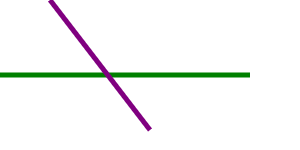

```js
// Draw ball on canvas
function drawBall() {
  ctx.beginPath();
  ctx.arc(ball.x, ball.y, ball.size, 0, Math.PI * 2);
  ctx.fillStyle = ball.visible ? '#0095dd' : 'transparent';
  ctx.fill();
  ctx.closePath();
}
```

```js
void ctx.arc(x, y, radius, startAngle, endAngle, anticlockwise);
/*  圆弧路径的圆心在 (x, y) 位置，半径为 r ，根据anticlockwise （默认为顺时针）指定的方向从 startAngle 开始绘制，到 endAngle 结束 */
```
fill（）方法填充当前图形（路径）。默认颜色是黑色。

## Date()
getFullYear()
使用 getFullYear() 获取年份。

getTime()
getTime() 返回从 1970 年 1 月 1 日至今的毫秒数。

setFullYear()
如何使用 setFullYear() 设置具体的日期。

toUTCString()
如何使用 toUTCString() 将当日的日期（根据 UTC）转换为字符串。

getDay()
如何使用 getDay() 和数组来显示星期，而不仅仅是数字。

Display a clock
如何在网页上显示一个钟表。

```js
new Date();
new Date(value);
new Date(dateString);
new Date(year, monthIndex [, day [, hours [, minutes [, seconds [, milliseconds]]]]]);

var today = new Date()
var d1 = new Date("October 13, 1975 11:13:00")
var d2 = new Date(79,5,24)
var d3 = new Date(79,5,24,11,33,0)
```

## .closest()
closest() 方法返回被选元素的第一个祖先元素。
```js
//返回 <span> 的第一个祖先元素，是一个 <ul> 元素：
$(document).ready(function(){
    $("span").closest("ul").css({"color":"red","border":"2px solid red"});
});
```

## window.SpeechRecognition
https://developer.mozilla.org/en-US/docs/Web/API/SpeechRecognition
在SpeechRecognition该界面的Web语音API是用于识别服务的控制器接口; 这也处理SpeechRecognitionEvent来自识别服务的发送。

## .isNaN()
如果 x 是特殊的非数字值 NaN（或者能被转换为这样的值），返回的值就是 true。如果 x 是其他值,则返回 false。

## Node.parentElement
返回当前节点的父元素节点，如果该元素没有父节点，或者父节点不是一个 DOM 元素，则返回 null。
和 Node.parentNode 的区别是它只返回 element 而后者有可能返回 document 节点

## 兄弟节点
在获取前一个兄弟节点的时候可以使用previousSibling和previousElementSibling。他们的区别是previousSibling会匹配字符，包括换行和空格，而不是节点。previousElementSibling则直接匹配节点。  
同previousSibling和previousElementSibling，nextSibling和nextElementSibling也是类似的。  

